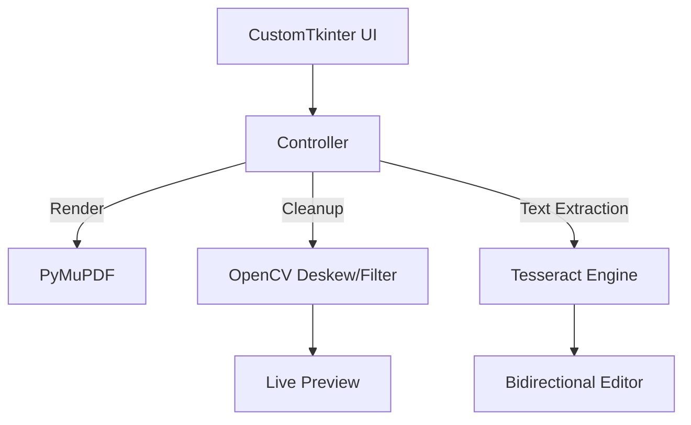

# PDF Suite


> **A Full-Spectrum Document Manipulation & OCR Correction Toolkit.**

---

## 📸 Demo


---

## 💼 The Challenge

In an operations environment, we frequently deal with bad scans, tilted pages, and unsearchable PDFs. Existing tools were either too expensive (Adobe Acrobat) or too limited (online splitters). I needed a single "Swiss Army Knife" application that could not only merge/split files but also clean up dirty scans and allow humans to fix OCR errors efficiently.

## 🛠️ The Solution

I developed a GUI-based desktop application using **CustomTkinter** that integrates multiple open-source libraries into a cohesive workflow.

* **Scan Cleanup:** Leveraged **OpenCV** to detect document skew angles and automatically rotate pages to be perfectly straight, applying Otsu’s thresholding to convert gray scans to crisp black-and-white.
* **Bidirectional OCR:** Built a custom UI where the PDF view and the text editor are linked. Clicking a word on the PDF highlights it in the text editor, and vice-versa. This tightly coupled UX speeds up the verification process significantly.

---

## 🚀 Technical Highlights (The "Secret Sauce")

**Bidirectional UX Logic**
The most complex engineering challenge was mapping the coordinate system of the rendered PDF image back to the character indices of the text editor. I implemented a coordinate transformation system that tracks the bounding box of every recognized word. When a user selects text, the app calculates the intersection of those indices with the visual bounding boxes to render a "highlight" overlay on the canvas in real-time.

### Key Code Snippet

```python
def on_pdf_click_for_highlight(self, event: Any) -> None:
    """
    Handles clicks on the PDF viewer in the OCR Correction tab.
    Maps canvas coordinates back to text character indices.
    """
    # Find the clicked word based on bounding boxes
    clicked_word = None
    for word in self.ocr_word_data:
        if (word['left'] <= original_x < word['left'] + word['width'] and
            word['top'] <= original_y < word['top'] + word['height']):
            clicked_word = word
            break
    
    if clicked_word:
        # Use the char indices to find the start and end positions in the textbox
        start_index = self.correction_text.index(f"1.0 + {clicked_word['start_char']} chars")
        end_index = self.correction_text.index(f"1.0 + {clicked_word['end_char']} chars")

        # Sync the selection
        self.correction_text.tag_add("sel", start_index, end_index)
```

---

## 🏗️ Architecture & Tech Stack

This application was built to be scalable and maintainable using the following technologies:

| Category | Technologies |
|----------|-------------|
| **UI** | Python, CustomTkinter |
| **Core Processing** | PyMuPDF (Fitz) for rendering/manipulation |
| **Computer Vision** | OpenCV (Deskewing), Scikit-Image (Thresholding) |
| **OCR** | Tesseract Engine, Pytesseract |

### Application Flow


---

## 🔐 Licensing & Access

This software is a proprietary tool designed for high-volume document processing.

**Availability:**
* **Source Code:** Closed Source (Private Repository)
* **Binaries:** Available for Windows and macOS.

This application is available for licensing by organizations looking to streamline their document workflows. Please contact me for a demo or pricing information.

---

## 📬 Contact

**Aaron** *Operations Manager turned Python Developer* Looking to automate your business operations?  
[View Portfolio Website](https://bearded1derer.github.io/) | [Connect on LinkedIn](https://www.linkedin.com/in/aaron-arpin-979a1354/)
